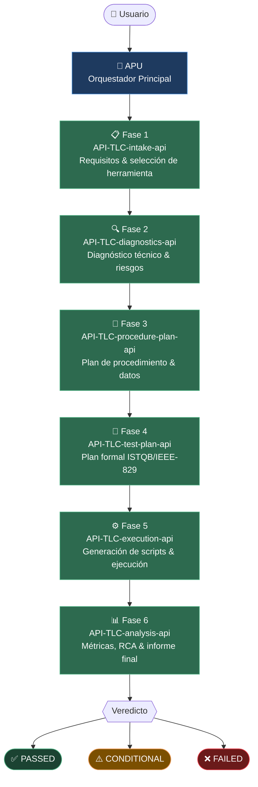
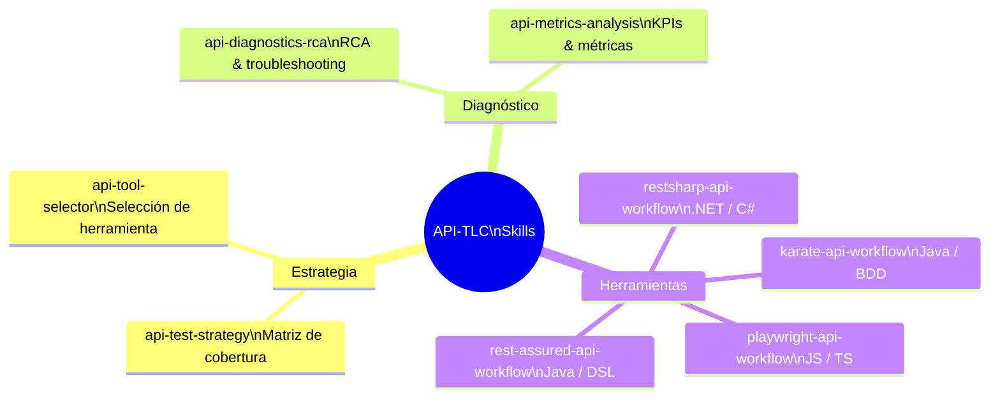
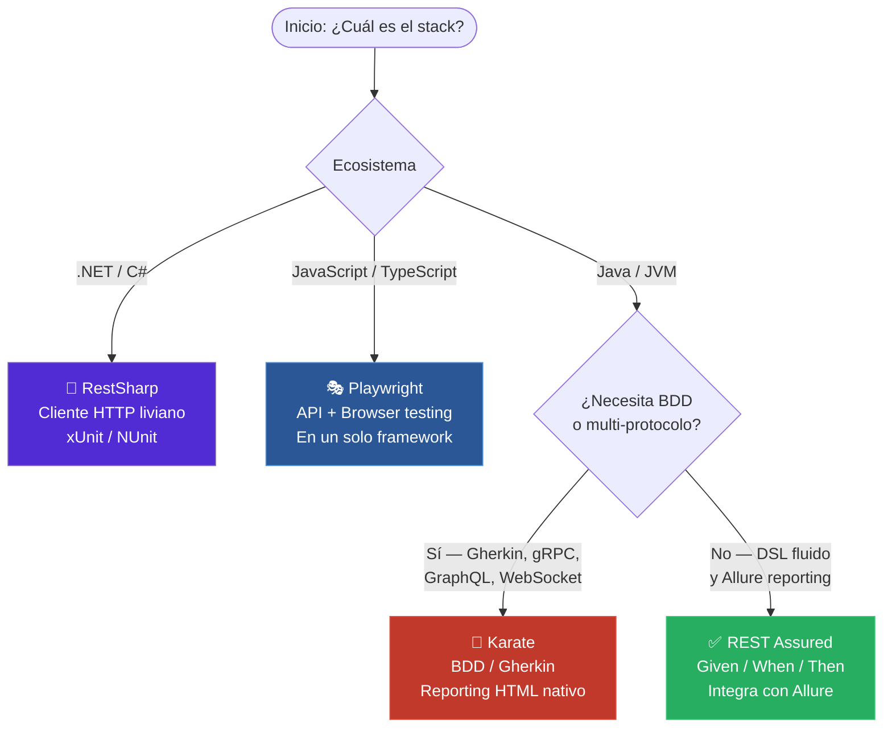
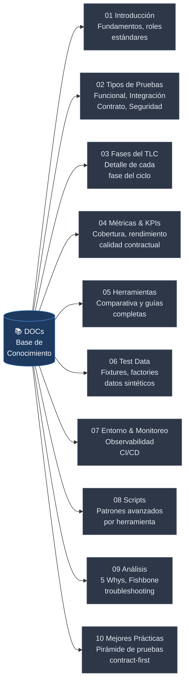
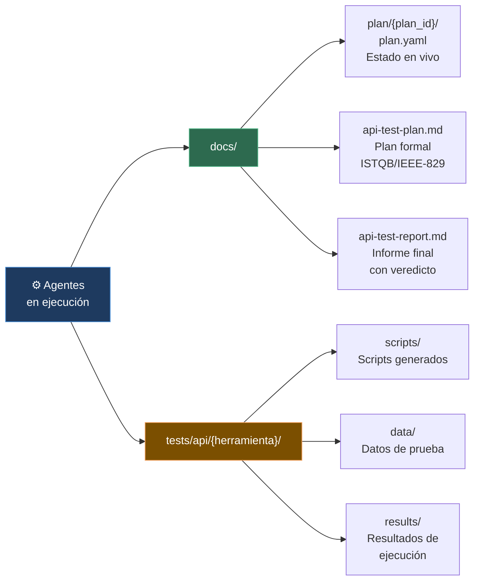
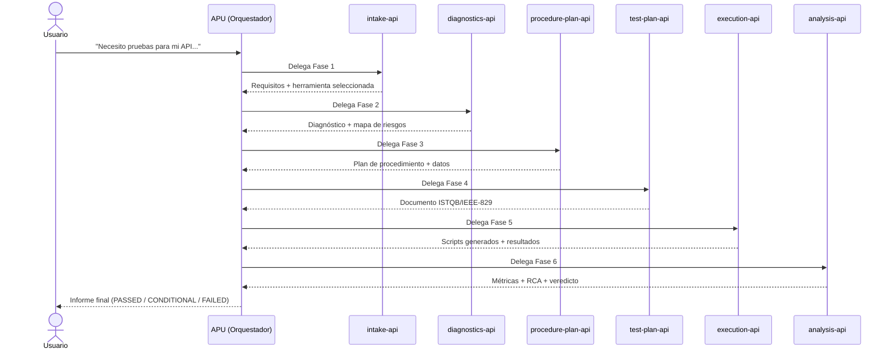
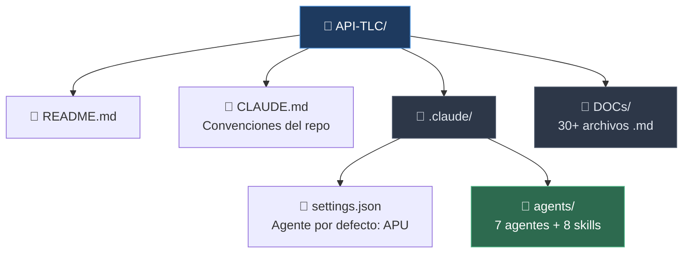
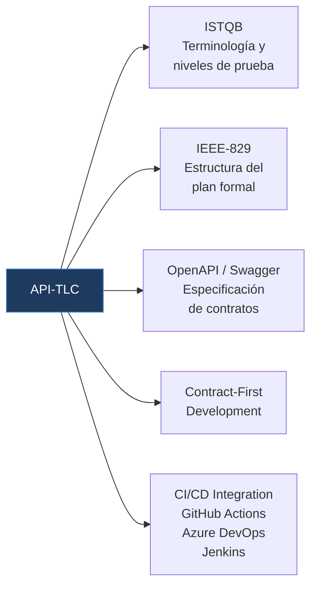

# API-TLC — API Test Life Cycle Orchestrator v1.0

Sistema de orquestación inteligente para el ciclo de vida completo de pruebas de API, implementado como una base de conocimiento con agentes de IA especializados sobre **Claude Code** (Anthropic).

---

## ¿Qué es API-TLC?

API-TLC es un repositorio-cerebro que define agentes de IA y habilidades especializadas para guiar, generar y ejecutar pruebas de API de extremo a extremo. No es un proyecto de código tradicional: es la *inteligencia* que los agentes de IA utilizan para tomar decisiones, seleccionar herramientas, generar scripts y producir informes profesionales para cualquier API que se le indique.

Corre sobre **Claude Code** (Anthropic) usando el sistema de agentes y skills nativos de Claude. El sistema sigue estándares de la industria (**ISTQB**, **IEEE-829**, **OpenAPI/Swagger**) y soporta cuatro herramientas de testing de API líderes.

---

## Arquitectura del Sistema

### Flujo de Orquestación

### Los 7 Agentes

| Agente | Fase | Responsabilidad |
|--------|------|-----------------|
| `api-tlc-orchestrator-api` | — | Entrada única; coordina todas las fases |
| `api-tlc-intake-api` | 1 | Levantamiento de requisitos y selección de la herramienta óptima |
| `api-tlc-diagnostics-api` | 2 | Diagnóstico técnico del entorno y evaluación de riesgos |
| `api-tlc-procedure-plan-api` | 3 | Tipos de prueba, escenarios y estrategia de datos |
| `api-tlc-test-plan-api` | 4 | Documento de plan de pruebas formal (ISTQB/IEEE-829) |
| `api-tlc-execution-api` | 5 | Generación de scripts y coordinación de ejecución |
| `api-tlc-analysis-api` | 6 | Análisis de métricas, RCA y reporte final con veredicto |

---

## Las 8 Habilidades (Skills)

---

## Herramientas de Testing Soportadas

### Árbol de Selección de Herramienta

| Herramienta | Ecosistema | Características clave |
|------------|------------|----------------------|
| **RestSharp** | .NET / C# | Cliente HTTP liviano; integra con xUnit/NUnit |
| **Karate** | Java / JVM | BDD con Gherkin; soporta HTTP, gRPC, GraphQL, WebSocket; reporting HTML nativo |
| **Playwright** | JavaScript / TypeScript | Testing API + browser en un solo framework |
| **REST Assured** | Java / JVM | DSL Given/When/Then; integra con Allure para reporting |

---

## Base de Conocimiento (`DOCs/`)

El sistema se respalda en más de 30 documentos en español organizados en 10 módulos temáticos.

---

## Artefactos Generados en Ejecución

---

## Cómo Usar

### Requisitos

- **Claude Code** instalado (`npm install -g @anthropic-ai/claude-code` o descarga desde claude.ai/code).
- El archivo `.claude/settings.json` configura APU como agente por defecto del proyecto.

### Inicio rápido

1. Abre el directorio `API-TLC/` en Claude Code.
2. El agente APU se cargará automáticamente como agente por defecto (`.claude/settings.json`).
3. Describe la API que deseas probar y APU guiará el proceso completo de forma interactiva.

---

## Estructura del Repositorio

---

## Estándares y Metodologías

---

## Idioma

Toda la documentación, prompts de agentes y conocimiento base están en **español**, siguiendo la convención del proyecto definida en `AGENTS.md`.

---

## Convenciones del Proyecto

Antes de modificar agentes, habilidades o documentación, leer [`CLAUDE.md`](CLAUDE.md). Contiene:
- Reglas de naming para archivos generados
- Orden de ejecución de fases y dependencias entre agentes
- Reglas de selección de herramientas
- Pitfalls conocidos del sistema
