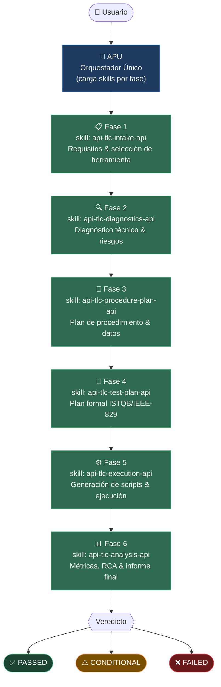
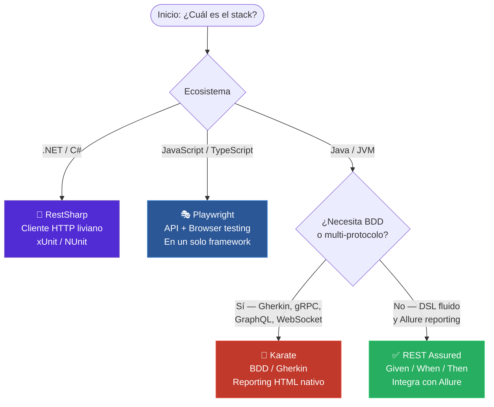
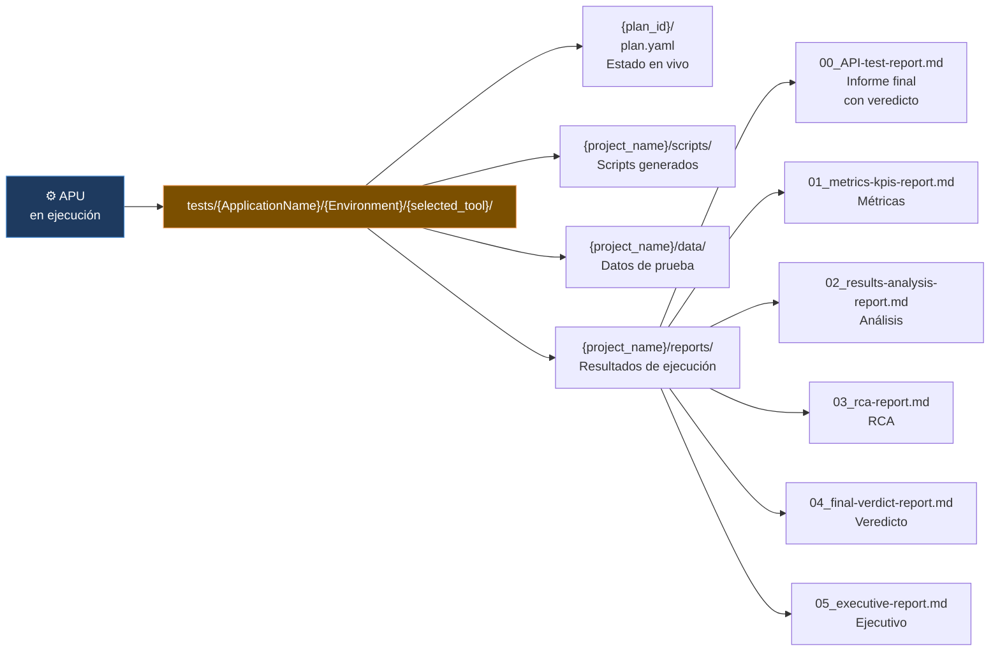
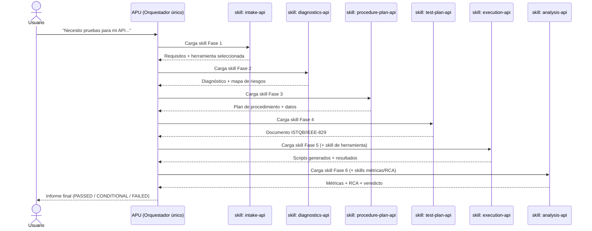
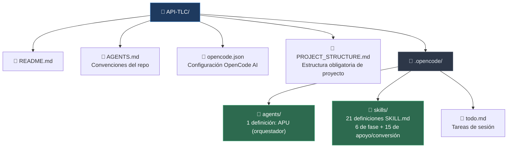
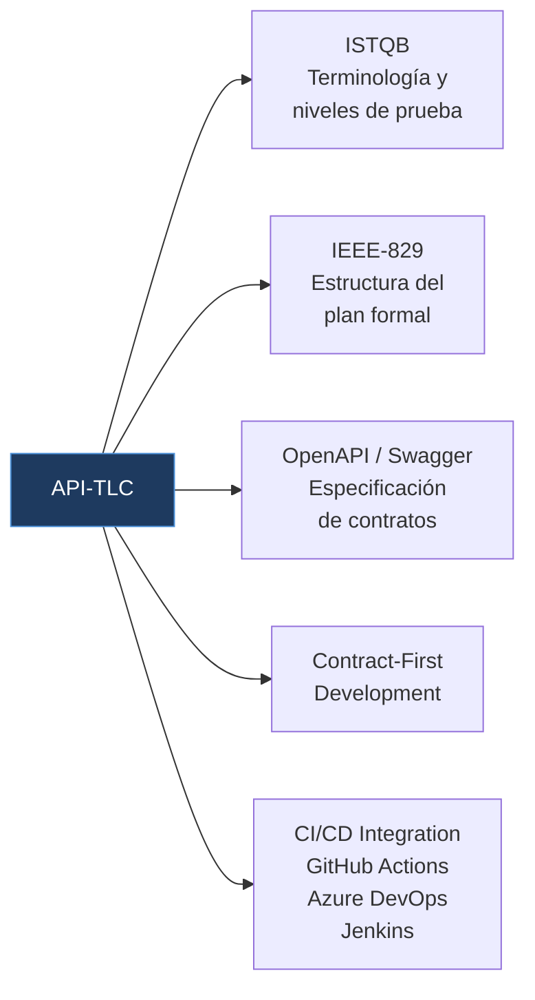

# API-TLC — API Test Life Cycle Orchestrator v1.0

Sistema de orquestación inteligente para el ciclo de vida completo de pruebas de API, implementado como una base de conocimiento con un agente de IA orquestador y skills especializadas sobre la plataforma **OpenCode AI**.

---

## ¿Qué es API-TLC?

API-TLC es un repositorio-cerebro que define **un único agente orquestador (APU)** y **21 skills especializadas** para guiar, generar y ejecutar pruebas de API de extremo a extremo. No es un proyecto de código tradicional: es la *inteligencia* que el agente utiliza para tomar decisiones, seleccionar herramientas, generar scripts y producir informes profesionales para cualquier API que se le indique.

El sistema sigue estándares de la industria (**ISTQB**, **IEEE-829**, **OpenAPI/Swagger**) y soporta cuatro herramientas de testing de API líderes.

**Principio de diseño:** todo el conocimiento de proceso vive dentro de las skills, que se cargan bajo demanda (solo cuando la fase las requiere). No hay árbol de documentación externa que ingerir — cero tokens desperdiciados en lecturas innecesarias.

---

## Arquitectura del Sistema

### Flujo de Orquestación

```mermaid
flowchart TD
    U([👤 Usuario]) --> APU

    APU["🤖 APU\nOrquestador Único\n(carga skills por fase)"]

    APU --> F1["📋 Fase 1\nskill: api-tlc-intake-api\nRequisitos & selección de herramienta"]
    F1 --> F2["🔍 Fase 2\nskill: api-tlc-diagnostics-api\nDiagnóstico técnico & riesgos"]
    F2 --> F3["📐 Fase 3\nskill: api-tlc-procedure-plan-api\nPlan de procedimiento & datos"]
    F3 --> F4["📄 Fase 4\nskill: api-tlc-test-plan-api\nPlan formal ISTQB/IEEE-829"]
    F4 --> F5["⚙️ Fase 5\nskill: api-tlc-execution-api\nGeneración de scripts & ejecución"]
    F5 --> F6["📊 Fase 6\nskill: api-tlc-analysis-api\nMétricas, RCA & informe final"]

    F6 --> V{{"Veredicto"}}
    V --> P(["✅ PASSED"])
    V --> C(["⚠️ CONDITIONAL"])
    V --> X(["❌ FAILED"])

    style APU fill:#1e3a5f,color:#fff,stroke:#4a90d9
    style F1 fill:#2d6a4f,color:#fff,stroke:#52b788
    style F2 fill:#2d6a4f,color:#fff,stroke:#52b788
    style F3 fill:#2d6a4f,color:#fff,stroke:#52b788
    style F4 fill:#2d6a4f,color:#fff,stroke:#52b788
    style F5 fill:#2d6a4f,color:#fff,stroke:#52b788
    style F6 fill:#2d6a4f,color:#fff,stroke:#52b788
    style P fill:#1b4332,color:#fff,stroke:#52b788
    style C fill:#7b4f00,color:#fff,stroke:#f4a261
    style X fill:#6b1a1a,color:#fff,stroke:#e63946
```

### 1 Agente + 21 Skills

| Tipo | Skill | Fase | Responsabilidad |
|------|-------|------|-----------------|
| **Agente** | `api-tlc-orchestrator-api` (APU) | — | Único punto de entrada; orquesta todas las fases |
| Fase | `api-tlc-intake-api` | 1 | Levantamiento de requisitos y selección de la herramienta óptima |
| Fase | `api-tlc-diagnostics-api` | 2 | Diagnóstico técnico del entorno y evaluación de riesgos |
| Fase | `api-tlc-procedure-plan-api` | 3 | Tipos de prueba, escenarios y estrategia de datos |
| Fase | `api-tlc-test-plan-api` | 4 | Documento de plan de pruebas formal (ISTQB/IEEE-829) |
| Fase | `api-tlc-execution-api` | 5 | Generación de scripts y coordinación de ejecución |
| Fase | `api-tlc-analysis-api` | 6 | Análisis de métricas, RCA y reporte final con veredicto |
| Apoyo | `api-tool-selector` | 1 | Matriz de decisión de herramientas |
| Apoyo | `api-test-strategy` | 3 | Coverage matrix y priorización |
| Apoyo | `api-metrics-analysis` | 4/6 | Targets numéricos, métricas y criterios de veredicto |
| Apoyo | `api-diagnostics-rca` | 2/6 | Técnicas de RCA (5 Whys, Fishbone) |
| Herramienta | `restsharp-api-workflow` | 5 | Workflow de scripts RestSharp (.NET/C#) |
| Herramienta | `karate-api-workflow` | 5 | Workflow de scripts Karate (Gherkin/BDD) |
| Herramienta | `playwright-api-workflow` | 5 | Workflow de scripts Playwright (JS/TS) |
| Herramienta | `rest-assured-api-workflow` | 5 | Workflow de scripts REST Assured (Java) |
| Conver| `export-response-to-openapi` | — | JSON → contrato OpenAPI 3.0 |
| Conver| `openapi-to-response-example` | — | OpenAPI → ejemplo de response JSON |
| Conver| `generate-api-test-matrix` | — | Requerimientos + OpenAPI → matriz de casos |
| Conver| `develop-detailed-test-cases` | — | Matriz → casos de prueba detallados |
| Conver| `export-test-cases-to-gherkin` | — | Casos detallados → archivos .feature Gherkin |
| Conver| `generate-test-artifacts` | — | Multi-formato: Bruno, Gherkin, Postman, etc. |
| Conver| `import-collection` | — | Colección → casos coded (RestSharp, Karate, Playwright, REST Assured) |

---

## Herramientas de Testing Soportadas

### Árbol de Selección de Herramienta

```mermaid
flowchart TD
    S([Inicio: ¿Cuál es el stack?]) --> Q1{Ecosistema}

    Q1 -->|.NET / C#| RS["🔷 RestSharp\nCliente HTTP liviano\nxUnit / NUnit"]
    Q1 -->|JavaScript / TypeScript| PW["🎭 Playwright\nAPI + Browser testing\nEn un solo framework"]
    Q1 -->|Java / JVM| Q2{¿Necesita BDD\no multi-protocolo?}

    Q2 -->|Sí — Gherkin, gRPC,\nGraphQL, WebSocket| KA["🥋 Karate\nBDD / Gherkin\nReporting HTML nativo"]
    Q2 -->|No — DSL fluido\ny Allure reporting| RA["✅ REST Assured\nGiven / When / Then\nIntegra con Allure"]

    style RS fill:#512bd4,color:#fff,stroke:#7c5cbf
    style PW fill:#2b5797,color:#fff,stroke:#4a90d9
    style KA fill:#c0392b,color:#fff,stroke:#e74c3c
    style RA fill:#27ae60,color:#fff,stroke:#2ecc71
```

| Herramienta | Ecosistema | Características clave |
|------------|------------|----------------------|
| **RestSharp** | .NET / C# | Cliente HTTP liviano; integra con xUnit/NUnit |
| **Karate** | Java / JVM | BDD con Gherkin; soporta HTTP, gRPC, GraphQL, WebSocket; reporting HTML nativo |
| **Playwright** | JavaScript / TypeScript | Testing API + browser en un solo framework |
| **REST Assured** | Java / JVM | DSL Given/When/Then; integra con Allure para reporting |

---

## Skills de Conversión Independientes

API-TLC ahora incluye **5 skills de conversión independientes** para flujos de trabajo de entrada y salida:

| Skill | Tipo | Tipo de Input | Tipo de Output | Principal Uso |
|-------|------|--------------|---------------|---------------|
| `export-response-to-openapi` | Conver | Response JSON (validado) | Contrato OpenAPI 3.0 (YAML/JSON) | Exportar response → OpenAPI |
| `openapi-to-response-example` | Conver | Contrato OpenAPI/Swagger | Ejemplo de response JSON | Generar ejemplo desde OpenAPI |
| `generate-api-test-matrix` | Conver | Requerimientos + OpenAPI | Matriz CSV/Markdown/Excel | Diseño inicial de pruebas |
| `develop-detailed-test-cases` | Conver | Matriz de casos | Casos detallados (JSON/YAML/Markdown) | Casos de prueba detallados |
| `export-test-cases-to-gherkin` | Conver | Casos detallados | Feature files Gherkin (.feature) | Casos BDD/Karate |
| `generate-test-artifacts` | Conver | Casos detallados | Multi-formato: Bruno, Gherkin, Postman, Karate, RestSharp, Playwright, REST Assured | Suite completa de artefactos |
| `import-collection` | Import | OpenAPI/Swagger, Bruno, Postman | Casos coded (RestSharp, Karate, Playwright, REST Assured) | Ingresar colección desde múltiples formatos |

Estas skills pueden usarse **independientemente** del pipeline principal del API-TLC, dando flexibilidad para:

- Importar un archivo Postman existente a cualquier framework soportado
- Convertir un response JSON a OpenAPI para contract-first development
- Generar una matriz rápidamente desde requerimientos y contratos
- Convertir una colección Bruno a Gherkin/BDD
- Crear una suite completa de artefactos en múltiples formatos

### Flujo de Conversión Independiente

```mermaid
graph TD
    A[Colección/Input] --> B{¿Qué convertir a?}
    B -->|OpenAPI/Swagger| C[`export-response-to-openapi`]
    B -->|Response] JSON| D[`openapi-to-response-example`]
    B -->|Requerimientos + OpenAPI| E[`generate-api-test-matrix`]
    B -->|Casos detallados| F[`develop-detailed-test-cases`]
    B -->|Feature .feature| G[`export-test-cases-to-gherkin`]
    B -->|Suite completa| H[`generate-test-artifacts`]
    B -->|Bruno/Postman| I[`import-collection`]
```

---

## Artefactos Generados en Ejecución

```mermaid
flowchart LR
    EX["⚙️ APU\nen ejecución"]

    EX --> T["tests/{ApplicationName}/{Environment}/{selected_tool}/"]

    T --> PL["{plan_id}/\nplan.yaml\nEstado en vivo"]
    T --> TPP["{project_name}/scripts/\nScripts generados"]
    T --> TPA["{project_name}/data/\nDatos de prueba"]
    T --> TPR["{project_name}/reports/\nResultados de ejecución"]
    TPR --> TR["00_API-test-report.md\nInforme final\ncon veredicto"]
    TPR --> TR1["01_metrics-kpis-report.md\nMétricas"]
    TPR --> TR2["02_results-analysis-report.md\nAnálisis"]
    TPR --> TR3["03_rca-report.md\nRCA"]
    TPR --> TR4["04_final-verdict-report.md\nVeredicto"]
    TPR --> TR5["05_executive-report.md\nEjecutivo"]

    style EX fill:#1e3a5f,color:#fff,stroke:#4a90d9
    style T fill:#7b4f00,color:#fff,stroke:#f4a261
```

> **Estructura Obligatoria**: Los proyectos deben generarse en `tests/{ApplicationName}/{Environment}/{selected_tool}/`. Ver `PROJECT_STRUCTURE.md` para el detalle completo.

---

## Ubicación de los Artefactos (Nuevo)

| Artefacto | Ruta | Descripción |
|-----------|-------|-------------|
| Plan activo | `{ApplicationName}/{Environment}/{selected_tool}/{plan_id}/plan.yaml` | Plan activo (workflows resumibles) |
| Estado del contexto | `{ApplicationName}/{Environment}/{selected_tool}/{plan_id}/context_envelope.json` | Envelope acumulado (evita releer) |
| Plan formal | `{ApplicationName}/{Environment}/{selected_tool}/{plan_id}/performance-test-plan.md` | Plan formal ISTQB/IEEE-829 |
| Scripts generados | `{ApplicationName}/{Environment}/{selected_tool}/{project_name}/scripts/` | Scripts listos para ejecutar |
| Datos de prueba | `{ApplicationName}/{Environment}/{selected_tool}/{project_name}/data/` | Datos paramétricos para los tests |
| Reporte API | `{ApplicationName}/{Environment}/{selected_tool}/{project_name}/reports/reports_{datestamp}_{iteration}/00_API-test-report.md` | Reporte general con veredicto |
| Reporte métricas | `{ApplicationName}/{Environment}/{selected_tool}/{project_name}/reports/reports_{datestamp}_{iteration}/01_metrics-kpis-report.md` | Métricas de rendimiento |
| Reporte RCA | `{ApplicationName}/{Environment}/{selected_tool}/{project_name}/reports/reports_{datestamp}_{iteration}/03_rca-report.md` | Análisis de causa raíz |
| Reporte ejecutivo | `{ApplicationName}/{Environment}/{selected_tool}/{project_name}/reports/reports_{datestamp}_{iteration}/05_executive-report.md` | Para stakeholders |

> **Estructura de Reports**: Cada ejecución de pruebas genera una subcarpeta `reports_{datestamp}_{iteration}` (ej: `reports_20251008_01`) dentro de `reports/`, permitiendo aislar resultados de corridas históricas.

> **Nota**: La estructura `docs/` ya no se utiliza para planes. El nuevo esquema de carpetas garantiza trazabilidad, aislamiento entre entornos y claridad en la organización de artefactos.

---

## Cómo Usar

### Requisitos

- **OpenCode AI** instalado y configurado.
- El archivo `opencode.json` en la raíz de `API-TLC/` configura APU como agente por defecto.

### Inicio rápido

```mermaid
sequenceDiagram
    actor U as Usuario
    participant APU as APU (Orquestador único)
    participant S1 as skill: intake-api
    participant S2 as skill: diagnostics-api
    participant S3 as skill: procedure-plan-api
    participant S4 as skill: test-plan-api
    participant S5 as skill: execution-api
    participant S6 as skill: analysis-api

    U->>APU: "Necesito pruebas para mi API..."
    APU->>S1: Carga skill Fase 1
    S1-->>APU: Requisitos + herramienta seleccionada
    APU->>S2: Carga skill Fase 2
    S2-->>APU: Diagnóstico + mapa de riesgos
    APU->>S3: Carga skill Fase 3
    S3-->>APU: Plan de procedimiento + datos
    APU->>S4: Carga skill Fase 4
    S4-->>APU: Documento ISTQB/IEEE-829
    APU->>S5: Carga skill Fase 5 (+ skill de herramienta)
    S5-->>APU: Scripts generados + resultados
    APU->>S6: Carga skill Fase 6 (+ skills métricas/RCA)
    S6-->>APU: Métricas + RCA + veredicto
    APU-->>U: Informe final (PASSED / CONDITIONAL / FAILED)
```

1. Abre el directorio `API-TLC/` en OpenCode AI.
2. El agente APU se cargará automáticamente como agente por defecto.
3. Describe la API que deseas probar y APU guiará el proceso completo de forma interactiva, cargando la skill de cada fase en orden.

---

## Estructura del Repositorio

```mermaid
graph TD
    ROOT["📁 API-TLC/"]

    ROOT --> README["📄 README.md"]
    ROOT --> AGENTS["📄 AGENTS.md\nConvenciones del repo"]
    ROOT --> OC["📄 opencode.json\nConfiguración OpenCode AI"]
    ROOT --> PS["📄 PROJECT_STRUCTURE.md\nEstructura obligatoria de proyecto"]
    ROOT --> OCD["📁 .opencode/"]

    OCD --> AG["📁 agents/\n1 definición: APU (orquestador)"]
    OCD --> SK["📁 skills/\n21 definiciones SKILL.md\n6 de fase + 15 de apoyo/conversión"]
    OCD --> TODO["📄 todo.md\nTareas de sesión"]

    style ROOT fill:#1e3a5f,color:#fff,stroke:#4a90d9
    style OCD fill:#2d3748,color:#e2e8f0,stroke:#4a5568
    style AG fill:#2d6a4f,color:#fff,stroke:#52b788
    style SK fill:#2d6a4f,color:#fff,stroke:#52b788
```

---

## Estándares y Metodologías

```mermaid
graph LR
    APITLC["API-TLC"] --> ISTQB["ISTQB\nTerminología y\nniveles de prueba"]
    APITLC --> IEEE["IEEE-829\nEstructura del\nplan formal"]
    APITLC --> OAS["OpenAPI / Swagger\nEspecificación\nde contratos"]
    APITLC --> CF["Contract-First\nDevelopment"]
    APITLC --> CICD["CI/CD Integration\nGitHub Actions\nAzure DevOps\nJenkins"]

    style APITLC fill:#1e3a5f,color:#fff,stroke:#4a90d9
```

---

## Idioma

Toda la documentación, prompts del agente y contenido de skills están en **español**, siguiendo la convención del proyecto definida en `AGENTS.md`.

---

## Convenciones del Proyecto

Antes de modificar el agente o las skills, leer [`AGENTS.md`](AGENTS.md). Contiene:
- Arquitectura de 1 agente + 14 skills y orden estricto de fases
- Ubicación de artefactos (plan, plan de pruebas, scripts, resultados, reporte)
- Reglas de selección de herramientas (single-tool por defecto)
- Pitfalls conocidos del sistema (smoke test obligatorio, NFRs numéricos, carga bajo demanda de skills)
